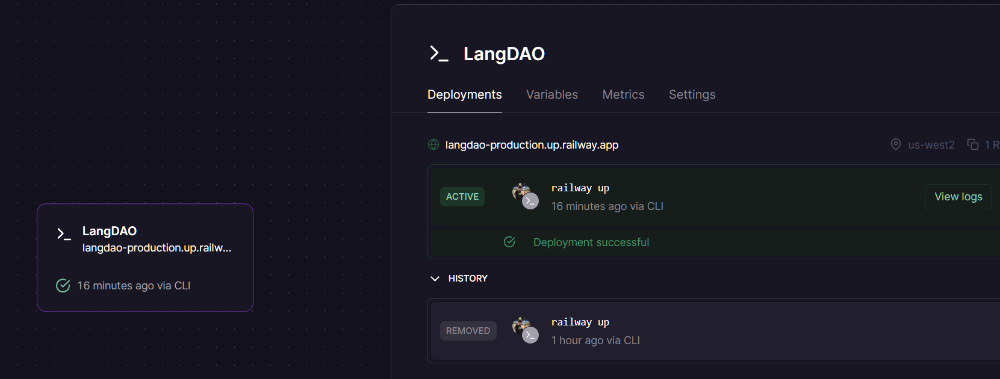

# LangDAO Video Call Service

A secure WebRTC video calling application designed for LangDAO's tutoring platform, enabling real-time video communication between students and tutors with integrated billing and session management.

## Overview

This WebRTC implementation facilitates high-quality video calls while providing real-time event tracking for billing, session management, and analytics integration with the LangDAO ecosystem.

## Features

- **Secure Video Calling**: End-to-end WebRTC communication
- **Real-time Billing**: Automatic session timing and cost calculation
- **Role-based Access**: Student/Tutor specific functionality
- **Session Management**: Comprehensive event tracking
- **HTTPS Security**: Production-ready with secure WebSocket connections
- **Professional UI**: Clean interface with visual feedback

## Quick Start

### Local Development

1. **Install Dependencies**
   ```bash
   npm install
   ```

2. **Start Server**
   ```bash
   node server.js
   ```

3. **Access Application**
   ```
   http://localhost:3000?room=test123&role=student
   http://localhost:3000?room=test123&role=tutor
   ```

### Production Deployment

**Live URL:** `https://langdao-production.up.railway.app`



**Example URLs:**
- Student: `https://langdao-production.up.railway.app?room=session123&role=student`
- Tutor: `https://langdao-production.up.railway.app?room=session123&role=tutor`

## URL Parameters

| Parameter | Description        | Values             | Required |
| --------- | ------------------ | ------------------ | -------- |
| `room`    | Session identifier | Any string         | Yes      |
| `role`    | User type          | `student`, `tutor` | Yes      |

## Security Requirements

### HTTPS Mandatory for Production

WebRTC requires HTTPS for camera/microphone access:

- ✅ **Development**: `http://localhost` (browser exception)
- ✅ **Production**: `https://langdao-production.up.railway.app`
- ❌ **HTTP in production**: Browser blocks media access

### WebSocket Security

The application automatically detects and uses secure protocols:

```javascript
// Auto-detection logic
const protocol = location.protocol === 'https:' ? 'wss:' : 'ws:';
const ws = new WebSocket(`${protocol}//${location.host}?room=${roomId}`);
```

- **Local**: `ws://localhost:3000`
- **Production**: `wss://langdao-production.up.railway.app`

## Integration with LangDAO

### Event System

The application sends real-time events for billing and session management:

#### Critical Events (Must Handle)

1. **Session Started** - Begin billing
2. **Timer Update** - Real-time cost calculation (every second)
3. **User Disconnected** - Stop billing immediately
4. **Session Ended** - Final payment processing

#### Analytics Events

5. **User Connected** - Session tracking
6. **User Actions** - Behavior logging (mute, video toggle)

### Backend Integration

**Required Endpoint:**
```
POST https://your-backend.com/api/webrtc-events
Content-Type: application/json
```

**Environment Variable:**
```bash
BACKEND_URL=https://your-backend.com/api/webrtc-events
```

### Frontend Integration

**PostMessage Listener:**
```javascript
window.addEventListener('message', (event) => {
  const { type, sessionId, elapsedSeconds } = event.data;

  switch(type) {
    case 'session-started':
      startBillingDisplay();
      break;
    case 'timer-update':
      updateCostDisplay(elapsedSeconds);
      break;
    case 'user-disconnected':
      handlePartnerDisconnected();
      break;
    case 'session-ended':
      showFinalBill();
      break;
  }
});
```

## Project Structure

```
webRTC/
├── server.js              # WebSocket signaling server
├── public/
│   ├── index.html         # WebRTC client application
│   └── assets/           # UI icons
│       ├── icons8-microphone-48.png
│       ├── icons8-camera-24.png
│       └── icons8-call-button-24.png
├── package.json
├── INTEGRATION_REPORT.md  # Detailed integration guide
└── README.md
```

## Technical Architecture

### WebRTC Flow

1. **Signaling Server**: Node.js WebSocket server handles offer/answer exchange
2. **STUN Server**: Google's STUN server for NAT traversal
3. **Peer Connection**: Direct browser-to-browser media streaming
4. **Event Tracking**: Real-time session monitoring

### Session Management

```javascript
// Room-based connections
const rooms = new Map(); // Track active sessions
ws.roomId = roomId;      // Associate connection with room
ws.userRole = userRole;  // Track user role (student/tutor)
```

### Billing Integration

- **Start**: When both peers connect
- **Update**: Every second via timer
- **Stop**: On disconnection or explicit end
- **Calculate**: `(elapsedSeconds / 3600) * hourlyRate`

## UI Components

### Control Buttons

| Button     | Active State     | Inactive State | Function          |
| ---------- | ---------------- | -------------- | ----------------- |
| Microphone | Green + MIC icon | Red + MIC icon | Audio toggle      |
| Camera     | Green + CAM icon | Red + CAM icon | Video toggle      |
| End Call   | Red + CALL icon  | -              | Terminate session |

### Visual Feedback

- **Speaking Indicator**: Green border animation on active audio
- **Connection Status**: Real-time display of connection state
- **Timer Display**: Live session duration

## Error Handling

### Media Access Errors

```javascript
// Comprehensive error handling
if (!window.isSecureContext && location.protocol !== 'https:') {
  throw new Error('HTTPS is required for camera/microphone access');
}

// Specific error messages
NotAllowedError: "Permission denied"
NotFoundError: "No camera/microphone found"
NotSupportedError: "Browser not supported"
```

### Connection Recovery

- **WebSocket reconnection**: Automatic retry on disconnect
- **ICE candidate handling**: Graceful failure handling
- **Backend notification**: Failed API calls logged but non-blocking

## Deployment

### Railway Deployment

1. **Connect Repository**: Link GitHub repo to Railway
2. **Auto-deploy**: Pushes trigger automatic deployment
3. **Environment Variables**: Set `BACKEND_URL` in Railway dashboard
4. **Domain**: Use provided Railway domain or custom domain

### Manual Deployment

```bash
# Using Railway CLI
railway login
railway link
railway deploy
```

## Testing

### Local Testing

```bash
# Terminal 1
node server.js

# Terminal 2 - Open two browser tabs
open http://localhost:3000?room=test&role=student
open http://localhost:3000?room=test&role=tutor
```

### Production Testing

1. **HTTPS Access**: Ensure using `https://` URL
2. **Media Permissions**: Allow camera/microphone access
3. **Console Check**: No WebSocket or media errors
4. **Cross-browser**: Test Chrome, Firefox, Safari

## Browser Support

- ✅ Chrome 70+
- ✅ Firefox 65+
- ✅ Safari 14+
- ✅ Edge 80+
- ❌ Internet Explorer (not supported)

## Troubleshooting

### Common Issues

**Media Access Denied**
- Solution: Use HTTPS, allow permissions, refresh page

**WebSocket Connection Failed**
- Local: Check server is running on port 3000
- Production: Verify HTTPS and wss:// protocol

**Black Icon Squares**
- Solution: Ensure assets copied to `public/assets/`

**No Video/Audio**
- Check camera/microphone hardware
- Verify browser permissions
- Test with different browser

### Debug Mode

Enable console logging:
```javascript
console.log('WebRTC Debug Mode');
pc.oniceconnectionstatechange = () => {
  console.log('ICE state:', pc.iceConnectionState);
};
```

## Contributing

1. Fork the repository
2. Create feature branch: `git checkout -b feature-name`
3. Commit changes: `git commit -m 'Add feature'`
4. Push to branch: `git push origin feature-name`
5. Submit pull request

## License

MIT License - see LICENSE file for details

## Support

For technical support or integration questions:
- Check `INTEGRATION_REPORT.md` for detailed integration guide
- Review browser console for error messages
- Verify HTTPS requirements are met

---

**Built for LangDAO** - Enabling seamless tutor-student video communication with integrated billing and session management.