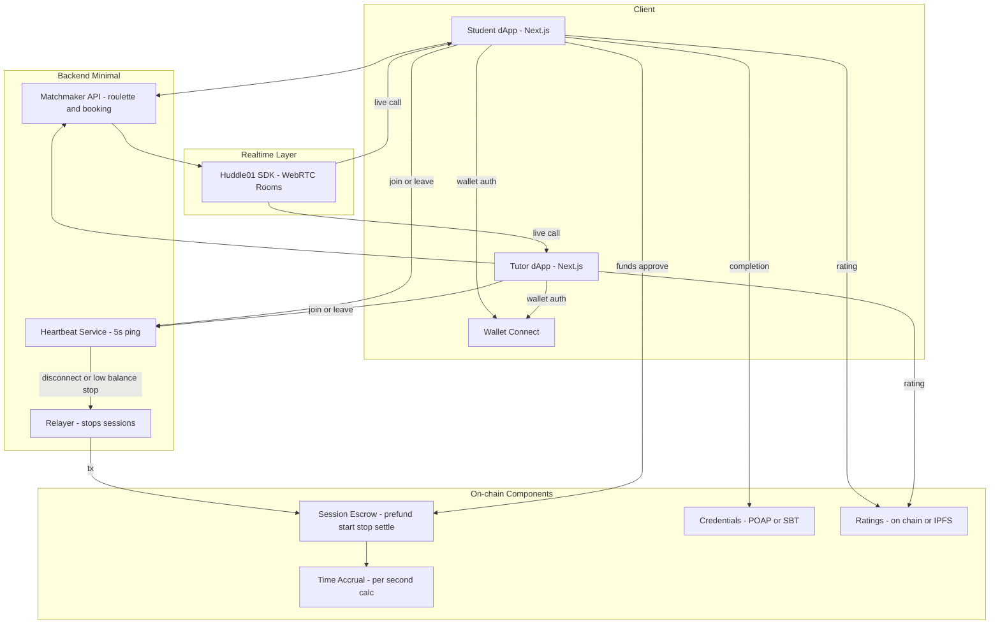
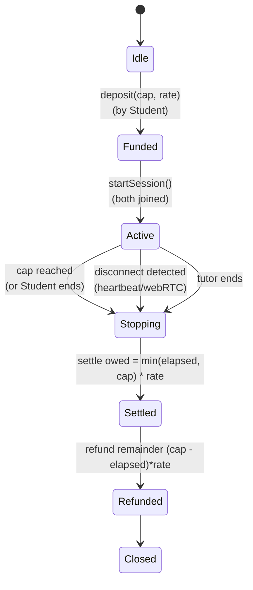
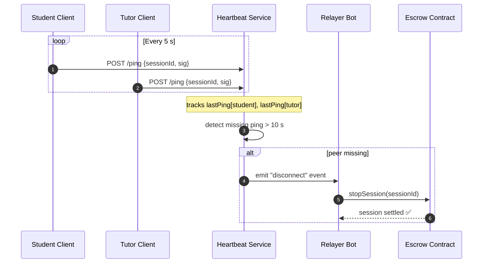
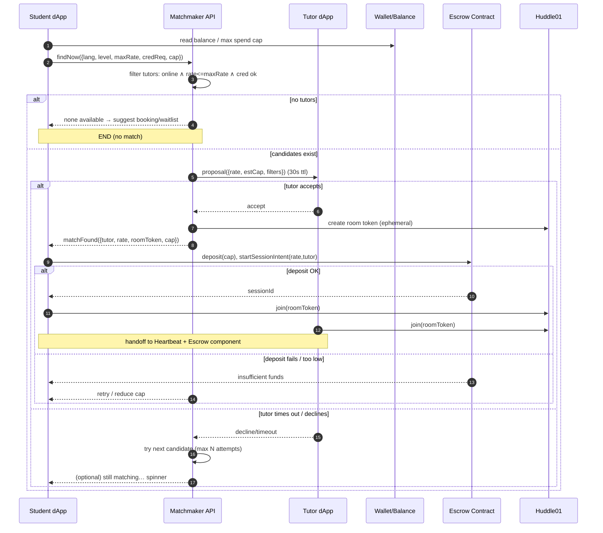
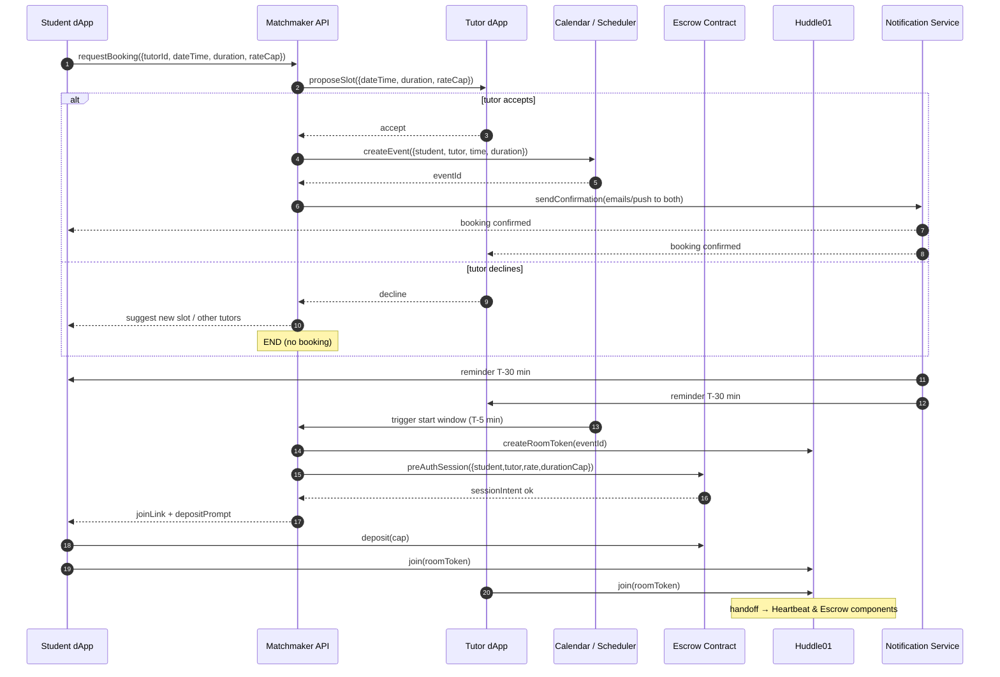
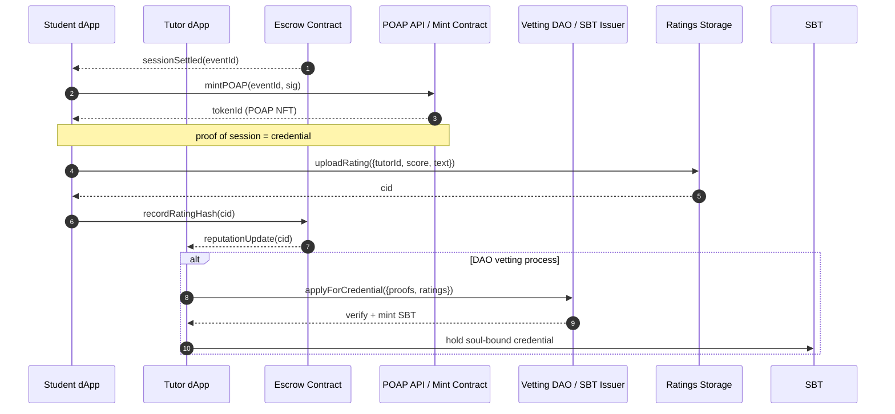

# Architecture (MVP)

This MVP lets a **Tutor** go online with a per-minute/per-second rate, and a **Student**:

- match via **roulette** or booking
- pay **only for time in call**
- get auto **call cutoff** when balance ends or either side disconnects
- receive **POAP/credential** (optional)
- rate the tutor and track progress

We minimize contracts to what’s essential for **time-billed calls** and **auto-stop**.

---

## High-level Components



## Key ideas

- **ESC** (Escrow) holds student funds for a **max duration**, prevents overpaying.
- **PAY** tracks elapsed time; settlement uses block timestamps (or a stream primitive).
- **HB** (Heartbeat) + **Huddle01** events trigger **REL** to stop payment if either peer drops.
- **M** pairs roulette or handles booked calls.
- **CRED** issues POAP/SBT; **RAT** stores ratings (on-chain or IPFS with on-chain hash).

## Component 1: Session Escrow (time-billed calls)

**Goal**: pay the tutor only for time in call; auto-stop on cap/disconnect.



### What this component does (and only this)

- **deposit(cap, rate)**: Student pre-funds max spend → moves to **Funded**.
- **startSession()**: Called once both are in the room → moves to **Active**.
- **elapsed accounting**: measured inside contract (block timestamps) or a “meter” submodule.
- **stop triggers:**
  - **cap reached,**
  - **disconnect** (from heartbeat/webRTC signal relayed on-chain),
  - **either party ends.**
- **settle()**: pay tutor **min(elapsed, cap) × rate**, refund remainder to student.
- **no overpaying, no post-drop leakage** by construction.

#### Caveats

What if the user wishes to keep the current session running longer than his deposit allows? Could be a UX bug.

## Component 2: Heartbeat & Auto-Stop

**Purpose**: guarantee that if either peer drops from a Huddle01 call, billing halts instantly.

### Concept

Each participant’s client emits a signed “I’m still here” ping every N seconds to a lightweight service.
If either side fails to send two consecutive heartbeats (≈ 10 s of silence), the service calls the on-chain `stopSession()` via a relayer.



### Behavior Summary

| Event                     | Trigger                 | Action                               |
| :------------------------ | :---------------------- | :----------------------------------- |
| ✅ Normal pings           | both clients responding | nothing changes                      |
| ⚠️ One peer silent > 10 s | network loss/closed tab | Heartbeat → Relayer → stopSession()  |
| Stop Acknowledgement      | Escrow settles          | tutor payout + student refund issued |

### Implementation notes

- Ping = small JSON {sessionId, walletAddr, signature}.
- Verification = HMAC / signature ensures no spoofing.
- Relayer = can be Biconomy, Gelato, OZ Defender or simple script with funded key.
- Timeout tunable (5 s, 10 s, 15 s).
- Logs feed optional analytics (“average disconnect time”).

## Component 3A — Matchmaker (Roulette “find tutor now”)

**Purpose**: pair a student with an available, matching tutor quickly, confirm the rate/cap, and hand off to escrow → call.

### Assumptions

- Student specifies **filters**: language, level, **max rate**, credential (optional SBT).
- Tutor sets **availability** + **per-second/minute rate** and optional credentials.
- We pre-check **student balance/cap** before proposing.



### Behavior

- **Filter** → **Propose** → **Accept** loop with **short TTL** to keep UX snappy.
- **Balance & cap pre-check** avoids proposing rates the student can’t afford.
- **Rate lock** at acceptance (for the session intent), so no last-second changes.
- On **accept**, we **create room**, then require **escrow deposit** before join.
- If **escrow fails**, offer **retry** or **reduce cap**; the tutor can be auto-released.

### Edge cases & timeouts

- No tutors → offer **booking** or **waitlist ping**.
- Tutor non-response → **retry next** (max N attempts, e.g., 3).
- Race conditions (two students propose same tutor): first **valid accept** wins; others get retry.

## Component 3B — Matchmaker (Booking Flow)

**Purpose**: let students **book tutors in advance**, ensure **both confirm**, and automatically trigger the **escrow + call** flow at the appointment time.



### Behavior Summary

| Phase         | Who                  | Action                                     |
| :------------ | :------------------- | :----------------------------------------- |
| Proposal      | Student -> Tutor     | request slot (date, duration, rateCap)     |
| Confirmation  | Tutor                | accept/decline → calendar entry            |
| Reminders     | Notification service | 30 min & 5 min pre-session                 |
| Pre-fund      | Student              | deposits cap before start                  |
| Session Start | System               | opens Huddle room + Escrow intent          |
| Live Call     | Both                 | proceeds under Heartbeat + Auto-Stop rules |

### Key Properties

- **Double opt-in**: prevents ghost bookings.
- **Pre-authorization**: ensures funds exist before the room opens.
- **Automation**: Cal/Notif triggers prevent manual coordination.
- **Handoff**: identical to roulette after join → no duplicate logic.

## Component 4 — Credentials & Ratings

**Purpose**: after every session, issue a verifiable proof of participation and update both participants’ reputations.
for vetted tutors, issue a **Soul-Bound Token (SBT)** to unlock credential-gated rooms.



### Credential Types

| Type                   | Purpose                          | Who mints                      | Transferable | Example                            |
| :--------------------- | :------------------------------- | :----------------------------- | :----------: | :--------------------------------- |
| POAP                   | Proof of attendance / completion | automatic API                  |      ✅      | Student finishes a lesson          |
| SBT (Tutor Credential) | DAO-vetted qualification         | DAO governance                 |      ❌      | “Certified Spanish native speaker” |
| Rating Record          | Session feedback                 | student → IPFS + hash on-chain |     n/a      | 5 stars, comment                   |

### Logic Highlights

- **Automatic POAP**: triggered by sessionSettled; minimal friction.
- **Reputation anchor**: each rating = IPFS CID + hash on-chain → verifiable, append-only.
- DAO vetting: a DAO multisig reviews proofs/ratings → issues an SBT NFT.
- Access control: smart-contract rooms or filters check balanceOf(SBT) > 0.

## Component 5 — DAO Vetting Flow (Tutor Credential SBT)

- [DAO Vetting Flow](dao-vetting.md)

# Architecture (High-Level)

## Diagram

```

Learner / Contributor (Wallet)
│
▼
Frontend (Next.js / React)
│
┌──────────┼───────────────────────────────┐
│ │ │
▼ ▼ ▼
Wallet Huddle01 SDK Credential Mint
Connect (Live Sessions) (POAP or minimal ERC-721)
(wagmi/viem) │ │
└───────────► Completion Signal │
│
▼
Reward Reminder / Claim payment(testnet)

```

## Components

- **Frontend:** Next.js + wagmi/viem for wallet connect.
- **Video:** **Huddle01** for low-latency, wallet-aware live sessions (optionally token-gated).
- **Credentials:** **POAP** (or minimal ERC-721) as proof of completion/participation.
- **Payment:** Streaming payment should be terminated upon session completion
- **Serverless (optional for MVP):** simple scheduling/metadata endpoints if needed.

## Primary Flows

1. **Join & Learn**
   - Connect wallet → view schedule → join live Huddle01 session.
2. **Verify & Credential**
   - Host marks completion → participant mints POAP/credential.
3. **Reward (MVP)**
   - Display mock reward, tutor should receive payment

## Notes & Constraints

- **MVP:** minimize backend; prefer client-side + third-party SDKs.
- **Abuse prevention (post-MVP):** host attestation, time-in-session checks, or allowlist for early pilots.
- **Scalability:** start single language (Spanish), design flows to be language-agnostic.

## Future Integrations (Post-Hackathon)

- **Chainlink**: attestations / automation for scheduled tasks.
- **Reputation**: simple on-chain badges → aggregated contributor profile.
- **Storage**: IPFS/Arweave for session metadata or recordings if needed.

```

```
