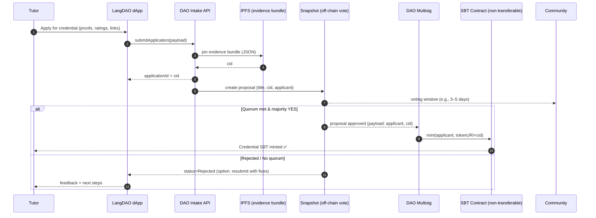
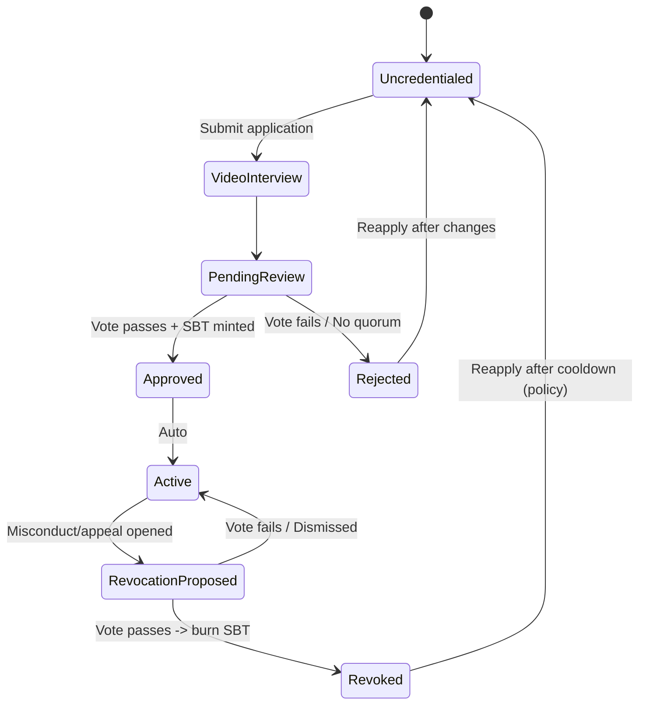

# DAO Vetting Flow (Tutor Credential SBT)

**Purpose**: community governance verifies tutors and issues a **non-transferable SBT** that unlocks credential-gated rooms.

## A) Governance sequence (from application to SBT mint)

### Notes

- **Evidence bundle**: CV, language certs, prior ratings (CIDs), sample sessions.
- **Snapshot**: transparent voting; proposal links to CID for reviewers.
- **Multisig**: executes mint after approval (clear separation of “signal” vs “execution”).
- **SBT tokenURI**: points to IPFS metadata (credential type, issuedAt, issuer).

## B) Credential lifecycle (state machine)

### Policy hooks

- **Cooldown** after rejection/revocation (e.g., 30–90 days).
- **Appeals** = new proposal referencing prior decision CID.
- **Granular credentials**: multiple SBT “tracks” (e.g., Spanish A2, Conversation Coach, Advanced Grammar) issued independently.

## C) How rooms enforce credentials

- Room configs include required **credential(s)** (SBT contract + tokenId range or trait).
- Join flow checks `SBT.balanceOf(user) > 0` (or `hasTrait(user, "Spanish-A2")`).
- Fallback: allow **observer** role without SBT (no paid host privileges).

## D) Minimal SBT contract (properties)

- **Non-transferable** (override `transferFrom/safeTransferFrom` to revert).
- **Mint** only by **DAO Multisig**.
- **Burn** only by **Multisig** (revocation) or **owner+Multisig** (appeal outcome).
- **tokenURI** = IPFS metadata; consider an **Attestation** layer later (EAS).
